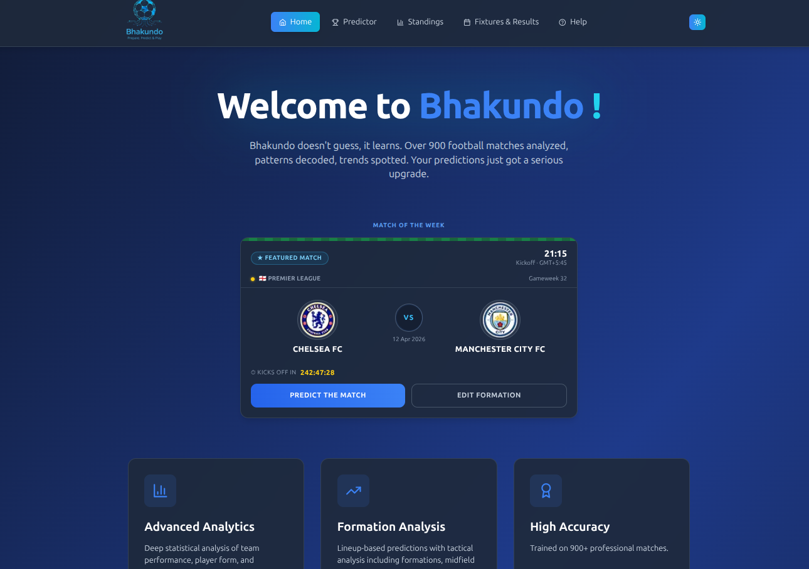
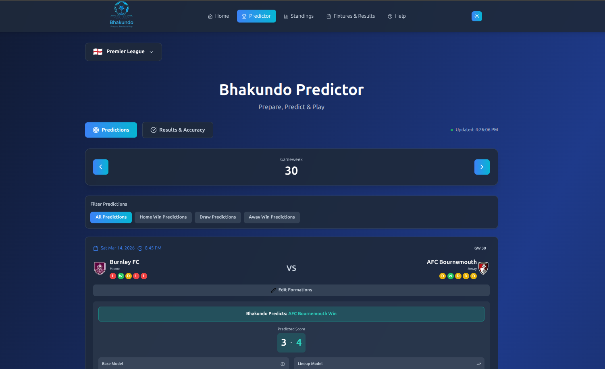
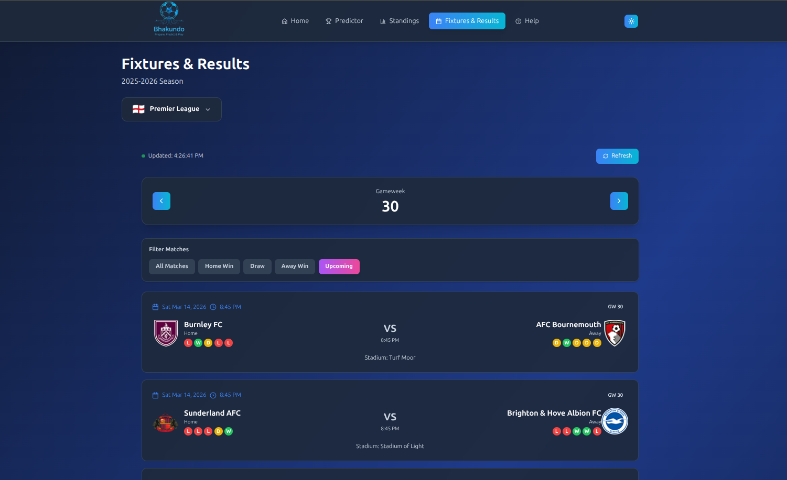
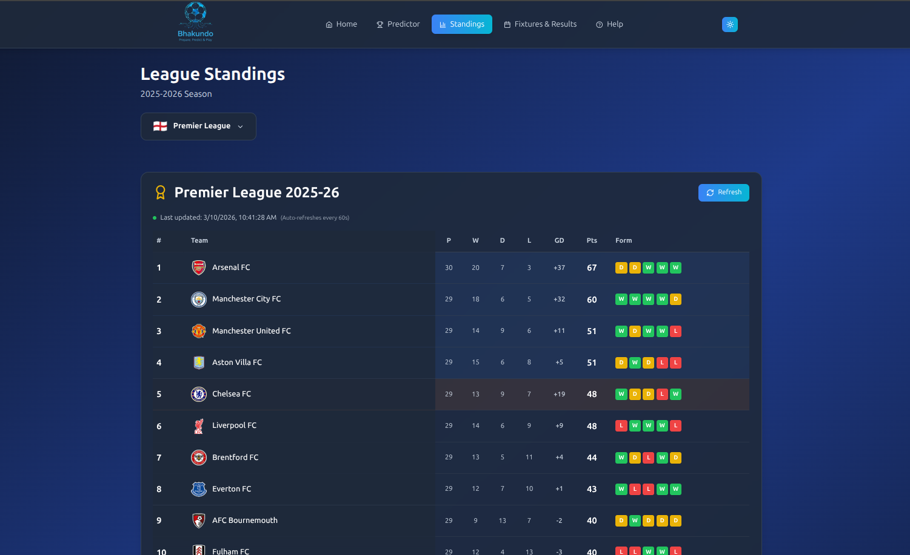
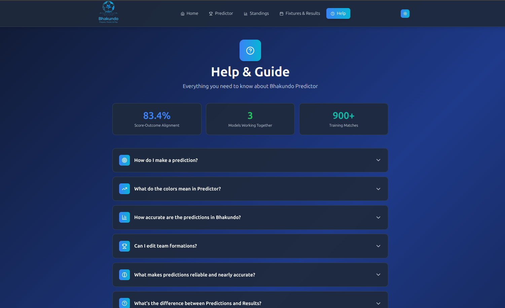
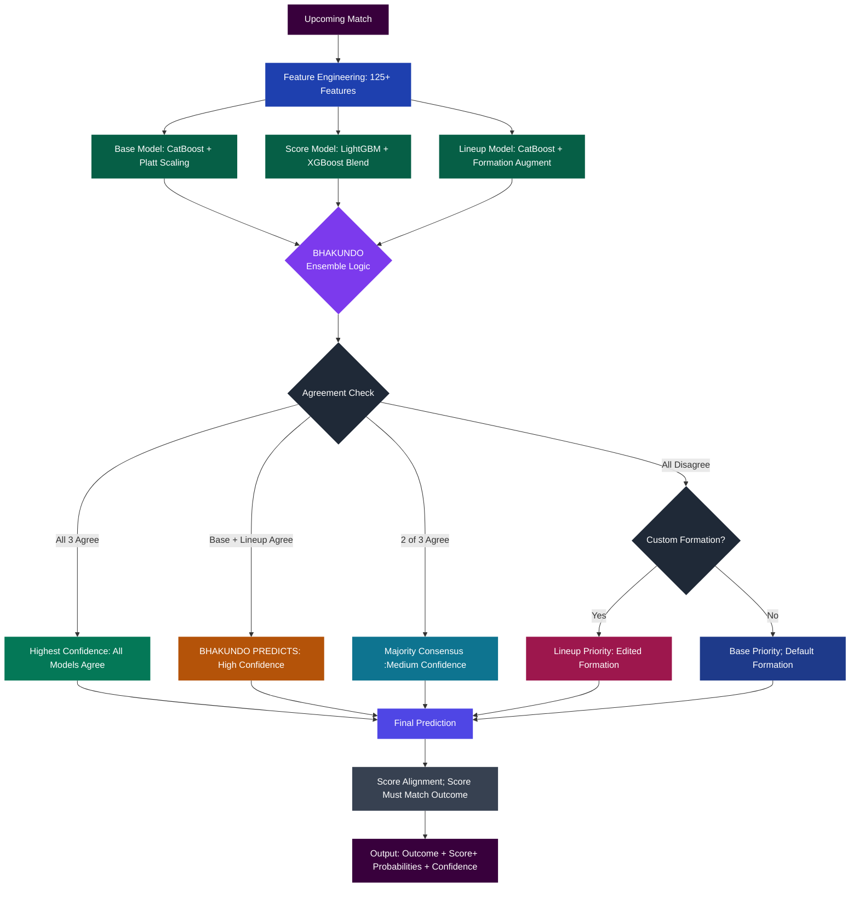

<p align="center">
  
</p>

<p align="center">
  <strong>Bhakundo – Prepare, Predict & Play</strong><br>
</p>

<p align="center">
  Live at: <a href="https://bhakundo.vercel.app">https://bhakundo.vercel.app</a>
</p>

---

## About

Bhakundo is a Football match prediction platform powered by a 3-model machine learning ensemble. It gives football fans a single place to view live fixtures, standings, and get predictions for upcoming matches with predicted scorelines, win probabilities.

---

## Screenshots

### Landing Page


### Predictor


### Fixtures & Results


### Standings


### Help


---

## Key Features

### For Football Enthsiasts
- Get match predictions with win/draw/loss probabilities
- View expected scorelines aligned to outcome predictions
- Browse live Football fixtures and results by gameweek
- View the current Premier League standings table

### Prediction Engine
- **Base Model** — CatBoost classifier trained on 133 features 
- **Score Model** — LightGBM + XGBoost blend predicting home and away goals via Poisson regression
- **Lineup Model** — CatBoost classifier with formation perturbation augmentation
- **Ensemble Logic** — BHAKUNDO priority system: Base + Lineup agreement triggers highest-confidence predictions; full disagreement falls back to formation-weighted priority

---

## Tech Stack

| Layer | Technology | Hosted On |
|---|---|---|
| Frontend |    |  |
| Backend |   |  |
| Database |  |  |
| ML Models |    | — |
| Live Data |   | — |

---

## Project Structure

```
bishalabps52-bhakundo/
├── backend/
│   ├── api_server.py            # Main FastAPI app — all endpoints
│   ├── ensemble_predictor.py    # BHAKUNDO priority ensemble logic
│   ├── model_classes.py         
│   ├── poisson_score_predictor.py  # Poisson score probability calculator
│   ├── football_api.py          # FPL + Football-Data.org API integration
│   ├── database.py              # SQLAlchemy models (Prediction, Actual)
│   ├── auth.py                  # API key + admin auth middleware
│   ├── requirements.txt
│   ├── render.yaml
│   └── scripts/
│       ├── pl_retrain_all_models_final.py  # Full training pipeline
│       ├── fetch_newgw.py                  # Fetch new GW results + retrain
│       ├── comprehensive_feature_engineering.py  # 125+ features builder
│       └── train_score_model_ensemble.py   # Score model training
├── frontend/
│   └── src/
│       ├── pages/               # index, predictor, fixtures, standings
│       ├── components/          # Navbar, Footer, FixturesPL, StandingsPL
│       ├── lib/                 # API config and fetcher
│       └── styles/
└── required/
    └── data/
        └── models/              # Trained .pkl model files
```

---

## Prediction Engine — How It Works



---

## Model Details

**Training data:** 1000+ finished Premier League matches (2023–2026)  
**Feature highlights:**  Venue stats, H2H, xG, Player Form, Home Form , Away Form , Goal For , Goal Against and many more

---

## Live Data Sources

- **Fantasy Premier League API** — fixtures, gameweek, team names 
- **Football-Data.org API** — match results, standings, live scores
- **Fallback** — formatted 2025-26 season CSV loaded from disk if APIs are unavailable

---

## Coming Soon

- User accounts with prediction history and accuracy tracking
- Prediction leaderboard across gameweeks
- La Liga, Bundesliga, UEFA Champions League and other football leagues support
- Automated retraining after each gameweek 

---

## Getting Started

### Prerequisites
- Node.js 18+
- Python 3.11+
- PostgreSQL

### Installation

#### Clone the repo
```bash
git clone https://github.com/BishalABPS52/bhakundo.git
```

#### Frontend
```bash
cd frontend
npm install
npm run dev
```
Runs on http://localhost:3000

#### Backend
```bash
cd backend
pip install --upgrade pip
pip install -r requirements.txt
uvicorn backend.api_server:app --reload --port 8000
```
Runs on http://localhost:8000

## Developer

### Built by [Bishal Shrestha](https://bishalshrestha52.com.np)

[](https://github.com/BishalABPS52)
[](https://www.linkedin.com/in/bishal-shrestha-2b05b1302/)
